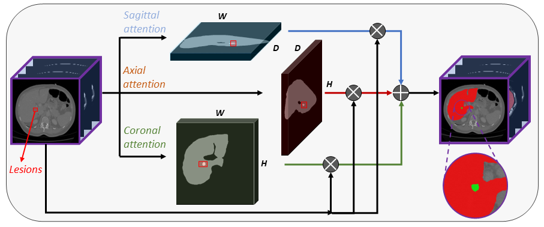

# APAUNet



---

## Introduction

By [Yuncheng Jiang*](https://scholar.google.com/citations?user=v5jDFU8AAAAJ&hl=zh-CN), [Zixun Zhang*](https://scholar.google.com/citations?user=13FeVFsAAAAJ&hl=zh-CN), [Shixi Qin](), [Yao guo](), [Zhen Li](https://scholar.google.com/citations?user=0TTt3QsAAAAJ&hl=zh-CN), [Shuguang Cui](https://scholar.google.com/citations?user=1o_qvR0AAAAJ&hl=zh-CN).

This repo is a PyTorch implementation of ["APAUNet: Axis Projection Attention UNet for Small Target Segmentation in 3D Medical Images"](https://arxiv.org/abs/2210.01485), accepted by ACCV 2022.

APAUNet is a segmentation network for 3D medical image data. It aims to improve the small targe segmentation accuracy using projection 2D attention mechanism on three axes. For more details, please refer to the paper.

The model was trained and test on the Medical Segmentation Decathlon Task 08 (Hepatic Vessels). APAUNet architecture is an architecture that has shown specially good results in segmentation of objects with a small size (like tumors or organs), but it has never been tried before this in a vessel segmentation context. 

The results obtained for vessel segmentation is competitive to the public results of the Medical Segmentation Decathlon. The code was modified to run it in Polyaxon. Each changed performed in the code is explained with a comment and some files (like tester.py) has been added.

---

## Dataset

### 1. Dataset download

Datasets can be acquired via following links:
* [Medical Segmentation Decathlon: Liver and Pancreas](https://drive.google.com/drive/folders/1HqEgzS8BV2c7xYNrZdEAnrHk7osJJ--2)

### 2. Setting up the datasets

After you have downloaded the datasets, you can follow the settings in * [nnUNet](https://github.com/NVIDIA/DeepLearningExamples/tree/master/PyTorch/Segmentation/nnUNet) for path configurations and preprocessing procedures.

Finally, your folders should be organized as follows:

```
./DATASET/
  ├── nnUNet_raw/
      ├── nnUNet_raw_data/
          ├── Task01_Liver/
              ├── imagesTr/
              ├── imagesTs/
              ├── labelsTr/
              ├── labelsTs/
              ├── dataset.json
          ├── Task02_Pancreas/
              ├── imagesTr/
              ├── imagesTs/
              ├── labelsTr/
              ├── labelsTs/
              ├── dataset.json
          ├── Task03_Synapse/
              ├── imagesTr/
              ├── imagesTs/
              ├── labelsTr/
              ├── labelsTs/
              ├── dataset.json
      ├── nnUNet_cropped_data/
  ├── nnUNet_trained_models/
  ├── nnUNet_preprocessed/
```

### 3. Pre-processing
We use a NVIDIA Preprocessing
```
git clone https://github.com/NVIDIA/DeepLearningExamples.git
cd DeepLearningExamples/PyTorch/Segmentation/nnUNet
```
After that, you can preprocess the above data using following commands:
```
python preprocess.py --task 08 --dim 3 --data "<path_to_dataset>" --results "<output_folder>"
```
Then the pre-processed data is stored in the output folder

---

## Usage 

### 0. Config

The code is set to run directly in Polyaxon, so each path is relative to the NAS folder.

All the training and testing hyper-parameters are set in [config.py](config.py). You can modify these configurations according to your requirements. 

#### Training parameters
- `model_name`: (string) name of model used (default APAUNet)
- `dataset`: (string) name of dataset used (default Task08_HepaticVessel)
- `data_path`: (string) folder path where is located the dataset (relative to NAS).
- `scheduler`: (string) learning rate scheduler to use (available options: CosineAnnealingLR, MultiStepLR, StepLR)
- `criterion`: (string) learning rate scheduler to use (available options: DiceFocal, Dice, DiceWeighted, BinaryFocalLoss, DiceBCELoss)
- `optimizer`: (string) optimizer to use (available options: SGD, Adam, adamw)
- `gamma`: (float) gamma parameter for the Focal Loss
- `alpha`: (float) alpha parameter for the Focal Loss
- `lr`: (float) learning rate for training the model
- `epochs`: (int) number of epochs to train the model
- `val_interval`: (int) number of epochs between checks of results in the validation set.
- `batch_size`: (int) number of volumes in batch.
- `in_ch`: (int) number of channels in the input volume (default to 1)
- `class_num`: (int) number of output classes (default to 1)
- `val_num`: (int) number of volumes to use for validation.
- `input_shape`: (int, int, int) shape for bounding crops of the input volumes to be introduced in the model.
- `resume`: (string) folder path where is located the .pth torch model to continue training.
- `use_cuda`: (bool) use gpu for using the model.
- `debug`: (bool) flag for debugging changes in the training loop (parameters changed to epochs=30, val_num=2, data_path="path_to_small_training_set")

#### Testing parameters
- `model_name`: (string) name of model used (default APAUNet)
- `dataset`: (string) name of dataset used (default Task08_HepaticVessel)
- `data_dir`: (string) folder path where is located the dataset (relative to NAS).
- `batch_size`: (int) number of volumes in batch.
- `in_ch`: (int) number of channels in the input volume (default to 1)
- `class_num`: (int) number of output classes (default to 1)
- `val_num`: (int) number of volumes to use for validation.
- `input_shape`: (int, int, int) shape for bounding crops of the input volumes to be introduced in the model.
- `resume`: (string) folder path where is located the .pth torch model to be tested.
- `use_cuda`: (bool) use gpu for using the model.


### 1. Training

```
python train.py 
```
Notice that in order to be used in polyaxon, a polyaxonfile has been already prepared:

```bash
polyaxon run -p <project_name> -f polyaxonfile.yaml
```

### 2. Testing

```
python tester.py
```
It will produce a predicted segmentation mask for the given testing data.

Notice that in order to be used in polyaxon, a different polyaxonfile has been already prepared:

```bash
polyaxon run -p <project_name> -f polyaxonfileTest.yaml
```
---
## Results

The dice score (%) results on testing for the test dataset created from Task 8 of Medical Segmentation Decathlon are possible to see it in the next table.

| Architecture| Dice Score |
| ------ | ------ |
| APAUNet | 65.4% |
| CLIP* | 67% |

*CLIP is the model ranked as first in the Medical Segmentation Decathlon by 27.03.2023

## Reference
* [NVIDIA Deep Learning Examples](https://github.com/NVIDIA/DeepLearningExamples/tree/master/PyTorch/Segmentation/nnUNet)
* [Weighted Dice Loss](https://ieeexplore.ieee.org/abstract/document/9180275)
* [CLIP Universal Model](https://github.com/ljwztc/CLIP-Driven-Universal-Model)
* [APAUNet](https://arxiv.org/abs/2210.01485)

## Citation

```
@inproceedings{apaunet2022,
    title={APAUNet: Axis Projection Attention UNet for Small Target Segmentation in 3D Medical Images},
    author={Jiang, Yuncheng and Zhang, Zixun and Qin, Shixi and Guo, Yao and Li, Zhen and Cui, Shuguang},
    booktitle={Proceedings of the Asian Conference on Computer Vision},
    year={2022}
}
```
